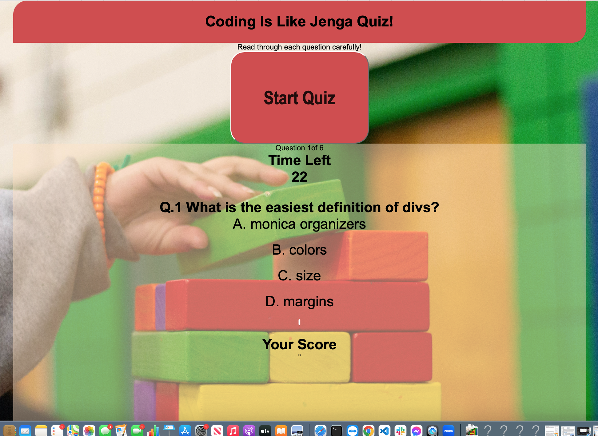

# Coding is like Jenga Quiz
### Description: 
I made this coding is like jenga quiz to give the user a more lively and comical experience that will intrigue them to see if the questions are a little different than their usual question and answers or if some are similar to what they normally take. The target user is mainly for coding students or junior programmers to review their knowledge.

# Built With: HTML, CSS and Javascript
# Getting Started:
# Prerequisites: N/A

# Installation: 
You should be able to play it on any browser.

# Usage: 
After you click on the start button. The timer will countdown from 30 as you go through the coding multiple choice questions. As you select the answers the points will increment or decrement in your score.

Contact: atsheridan38@gmail.com or 
Acknowledgments

https://wittyinventor.github.io/code-quiz/